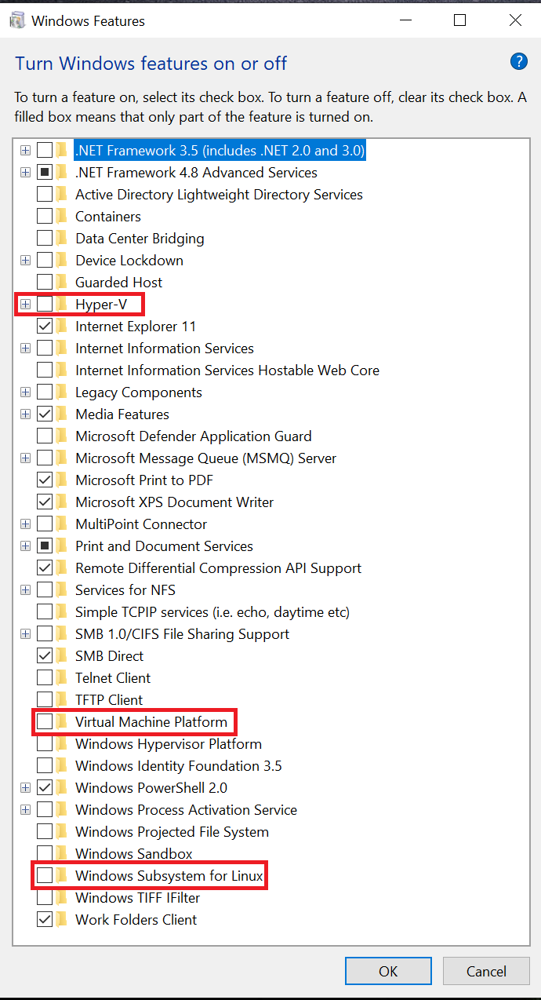
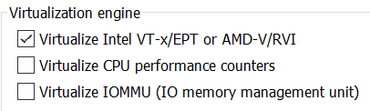

## Introduction
```bash
sudo apt-get update
sudo apt-get install qemu

git clone https://github.com/mit-pdos/xv6-public.git
# switch to tag xv6-rev9
```

## Problems
### Qemu Virtualization Not Working

- Description:

```bash
***
*** Error: Couldn't find a working QEMU executable.
*** Is the directory containing the qemu binary in your PATH
*** or have you tried setting the QEMU variable in Makefile?
***
serial mon:stdio -drive file=fs.img,index=1,media=disk,format=raw -drive file=xv6.img,index=0,media=disk,format=raw -smp 2 -m 512 
make: serial: Command not found
make: [Makefile:216: qemu] Error 127 (ignored)
```

- Solution:
    - Analysis: Executing command in practice:
    ```
    qemu: fs.img xv6.img
	$(QEMU) -serial mon:stdio $(QEMUOPTS)

    QEMU = $(shell if which qemu > /dev/null; \
	then echo qemu; exit; \
    ...
    ```

    - Disable host windows features:  
    

    - Enable VMWare WorkStation features:  
    

    - Necessary Packages  
    qemu-system-i386 which emulated x86 32bit architecture.

